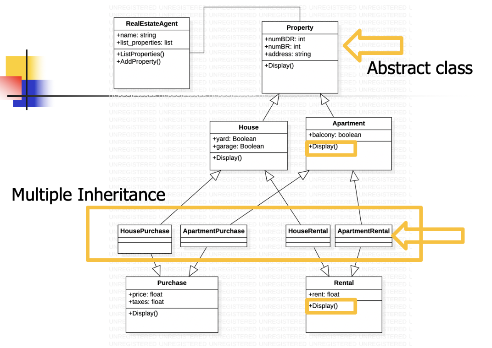

# Real Estate Agency Object Inheritance With Abstract Classes
This code has been expanded upon from (a previous repository)[https://github.com/jesuszeno2/Real-Estate-Agency-Object-Inheritance].

In this assignment for one of my classes, I implement a Real Estate Agency application. A real estate agency has many agents; each agent manages properties, which can be houses or apartments. Both can be for sale or rent (utilizing multiple inheritance). The UML diagram is given below. 

I add 2 new classes: purchase and rental. Furthermore, I use multiple Inheritance to create the classes HousePurchase, ApartmentPurchase,
HouseRental, and ApartmentRental. 

To make this simpler than the previous repository, none of the classes need methods that prompt the user for information about properties. I decided to experiment with kwargs to initialize objects via constructors. Furthermore, the class Property should now be an abstract class, and the method Display() should
be an abstract method.

The main.py file creates 2 agents objects. Next, I create 1 type of the new multiple inheritance property objects and distribute them among the 2 agents. Third, I iterate through the list of agents (objects) and print every agent’s properties, listing the property type (rental or sale), price or rent, and address.
